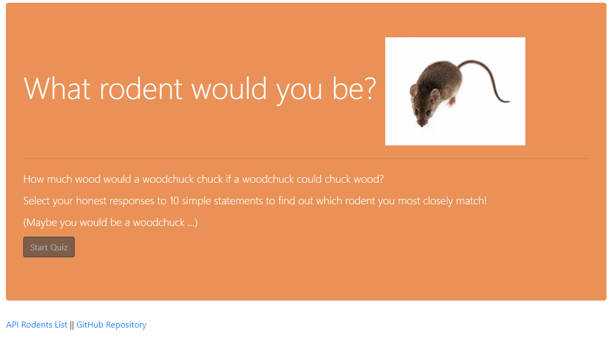

# FriendFinder (Rodent Match version)
created by Jennifer Gaumnitz
- - - -
A compatibility-based "FriendFinder-like" application. This full-stack mobile-responsive site takes in results from a quiz, then compares the answers with those from a prepopulated array of rodents. The app will then calculate the best match to the user's responses and display the name and picture of that rodent.
- - - -
Heroku deployed app: ADD LINK

GitHub repository: https://github.com/JLGaumnitz/FriendFinder
- - - -
### How You Can Get Started With This Project ###

<strong>To use the app:</strong> 

Simply go to the Heroku link above and click on the "Start Quiz" button at the bottom of the home page.

Once on the quiz page, enter your name and a link to a photo in the appropriate fields. Choose from the dropdown menus for all 10 statements and press the "Submit" button at the bottom of the page.

The best match will appear in a modal dialogue box. Press the "x" to close the box.

<strong>To create the app from my files in my GitHub repository:</strong> 

To install and use this application yourself, clone the GitHub repository. 

You will need to have installed:

* Node
* And these dependencies: express and path

Before running the server.js file in node.js, you will need to run "npm install." 

Then run "node server.js" at the command line to begin the server, and then navigate to localhost:8080 in your browser to see the HTML home page and proceed from there.

### Why the Project is Useful ###

  The app fulfills a homework assignment for University of Kansas Coding Boot Camp, August 2019 to February 2020. Besides allowing me to continue working with Node.js and npm packages, the assignment also allowed me to work with express and api routes.

### Where Users Can Get Help with This Project ###

  Questions? Contact Jennifer Gaumnitz at jlgaumnitz@gmail.com

### Who Maintains and Contributes to the Project ###

  Jennifer Gaumnitz created the project. I probably will not update it again after completing this assignment. 